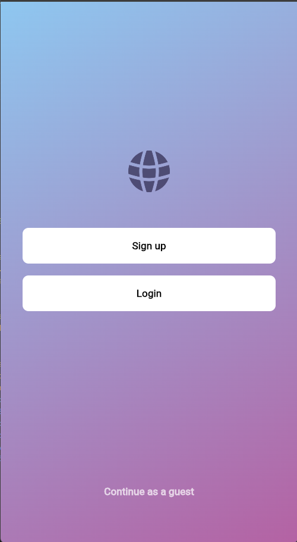
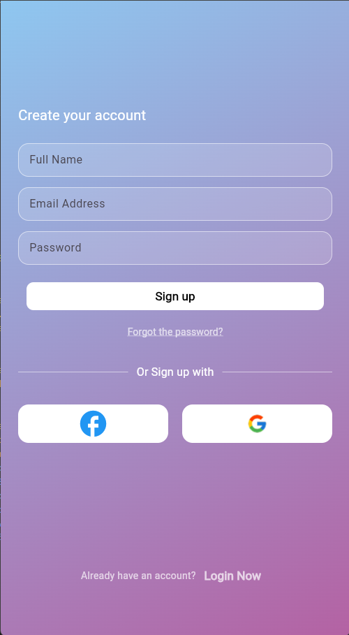
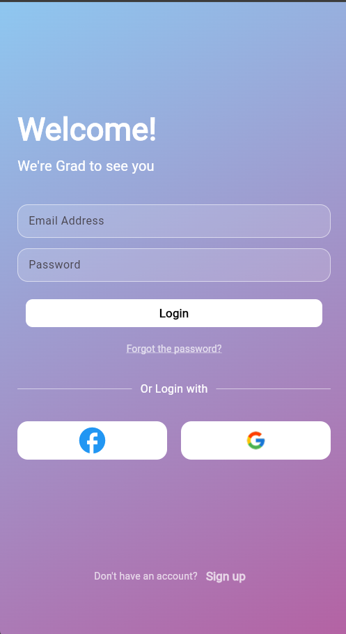
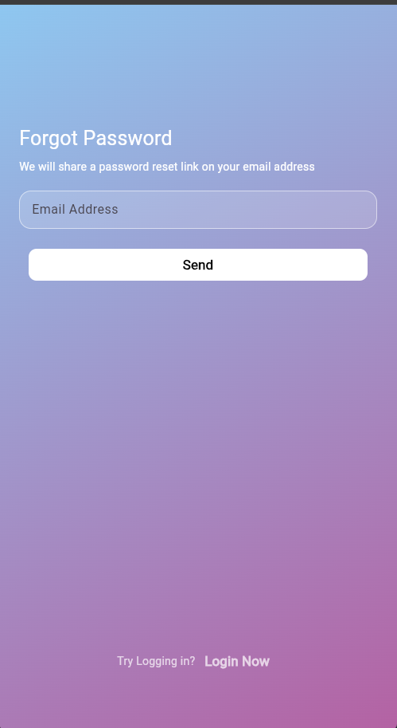

🔐 Login & Signup

A clean and modern authentication UI built with Flutter.

📱 Project Overview

Login & Signup is a Flutter mobile UI project focused on designing a simple and user-friendly authentication flow.

The project includes welcome, login, signup, and password recovery screens.

✨ UI Highlights

- Welcome screen
- Login screen
- Signup screen
- Forgot password screen
- Clean and modern authentication UI
- Simple and user-friendly navigation

## 📸 App Screenshots

  
  
  
  

📂 Project Structure

lib/
└── view/
    ├── Forgot_password.dart
    ├── login.dart
    ├── signup.dart
    └── welcome.dart

assets/
├── Google.png
└── world.png

🛠️ Technologies

- Flutter
- Dart

📌 Project Type

UI-focused Flutter mobile application.

«This project focuses on the authentication interface and user experience.»
